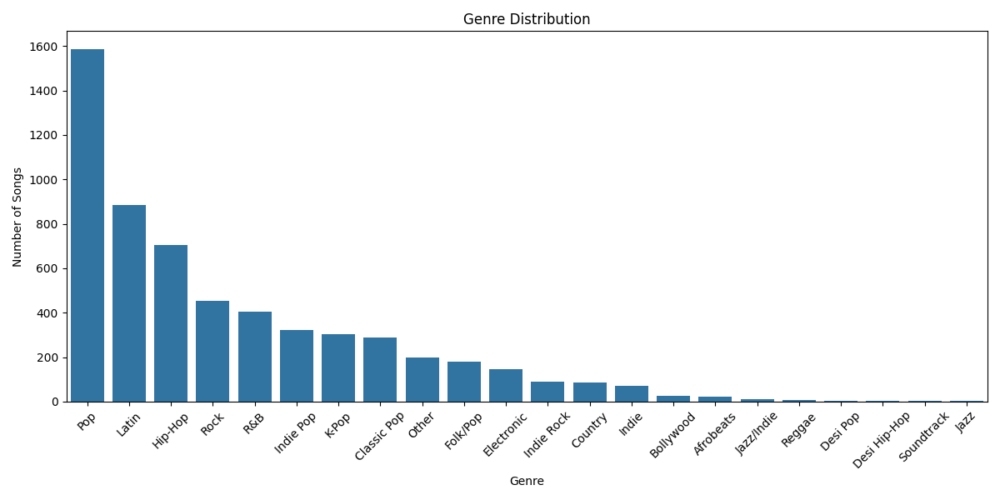
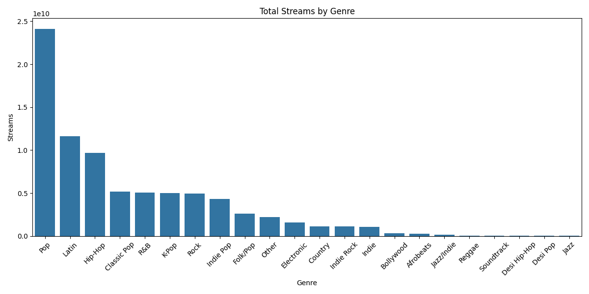
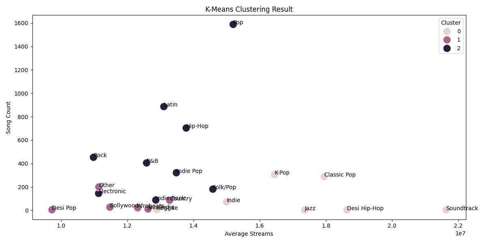
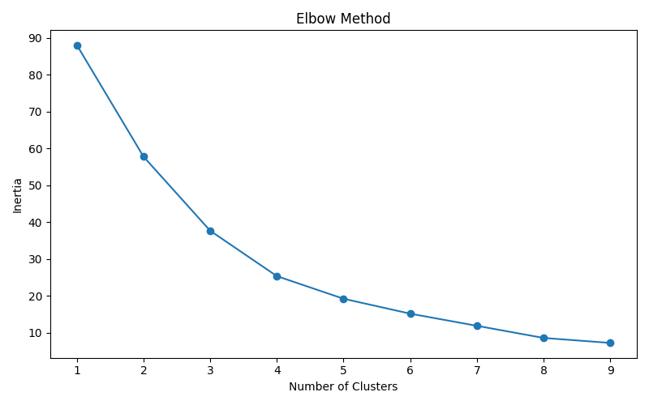
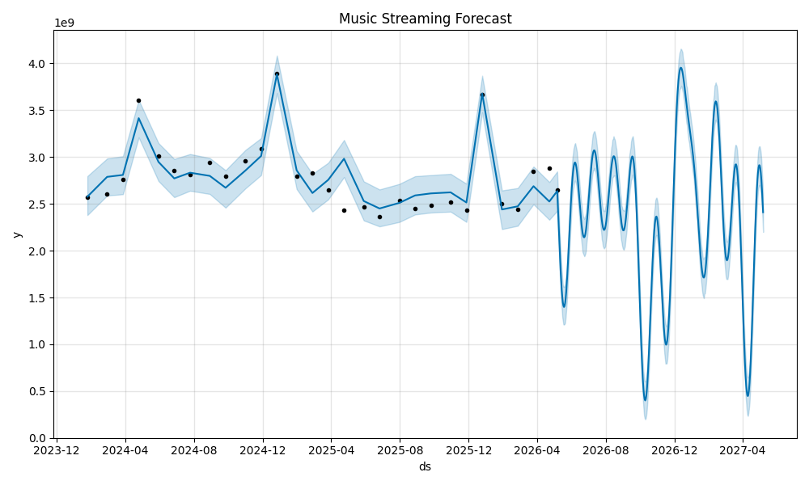

# 🎵 Spotify Music Chart Analytics with Machine Learning

Analisis dan prediksi tren musik Spotify menggunakan teknik **Machine Learning** — meliputi Exploratory Data Analysis (EDA), K-Means Clustering, dan Time Series Forecasting dengan Prophet.

## 📋 Deskripsi Project

Project ini menganalisis data chart musik Spotify tahun 2024 (Januari – Juli) yang mencakup **5.800 entries** dari **22 genre musik** berbeda. Tujuannya adalah untuk:

1. **Memahami distribusi dan tren genre musik** melalui EDA
2. **Mengelompokkan genre musik** berdasarkan karakteristik performa menggunakan K-Means Clustering
3. **Memprediksi tren streaming** 

## 📁 Struktur Project

```
ML_music_chart/
├── data/
│   └── spotify_final_cleaned.csv    # Dataset Spotify (5800 rows, 9 kolom)
├── notebooks/
│   ├── 01_eda.ipynb                 # Notebook EDA
│   ├── 02_kmeans_clustering.ipynb   # Notebook K-Means Clustering
│   ├── 03_prophet_forecasting.ipynb # Notebook Prophet Forecasting
│   └── main.py                      # Script runner utama
├── src/
│   ├── __init__.py
│   ├── eda.py                       # Module EDA
│   ├── clustering.py                # Module K-Means Clustering
│   └── forecasting.py               # Module Prophet Forecasting
├── outputs/
│   ├── genre_distribution.png       # Visualisasi distribusi genre
│   ├── genre_streams.png            # Visualisasi total streams per genre
│   ├── yearly_trend.png             # Visualisasi tren bulanan genre
│   ├── elbow_method.png             # Visualisasi Elbow Method
│   ├── clustering_result.png        # Visualisasi hasil K-Means
│   └── forecasting_result.png       # Visualisasi hasil forecasting
├── .venv/                           # Virtual environment (tidak di-push)
└── README.md
```

##  Dataset

| Kolom | Deskripsi |
|-------|-----------|
| `Position` | Posisi lagu di chart |
| `Track Name` | Nama lagu |
| `Artist` | Nama artis |
| `Genre` | Genre musik (22 kategori) |
| `Streams` | Jumlah streaming |
| `Date` | Tanggal chart (2024-01-01 s/d 2024-07-15) |
| `Year` | Tahun |
| `Month` | Bulan |
| `Weeks on Chart` | Lama lagu bertahan di chart (minggu) |

## 🔍 Analisis yang Dilakukan

### 1. Exploratory Data Analysis (EDA)
- **Distribusi Genre** — Menampilkan jumlah lagu per genre
- **Total Streams per Genre** — Membandingkan popularitas setiap genre
- **Monthly Genre Trend** — Tren streaming bulanan per genre sepanjang 2024

### 2. K-Means Clustering
- Feature engineering: Avg Streams, Avg Position, Song Count, Avg Weeks on Chart
- Penentuan jumlah cluster optimal dengan **Elbow Method**
- Clustering genre menjadi **3 kelompok** berdasarkan performa
- Evaluasi menggunakan **Silhouette Score**

### 3. Prophet Forecasting
- Time series forecasting menggunakan **Facebook Prophet**
- Prediksi tren streaming **365 hari** ke depan
- Visualisasi hasil forecast dengan confidence interval

##  Teknologi & Library

| Library | Versi | Kegunaan |
|---------|-------|----------|
| Python | 3.10+ | Bahasa pemrograman |
| Pandas | 2.3.x | Manipulasi data |
| Matplotlib | 3.10.x | Visualisasi |
| Seaborn | 0.13.x | Visualisasi statistik |
| Scikit-learn | 1.7.x | K-Means Clustering |
| Prophet | 1.3.x | Time Series Forecasting |
| Plotly | 6.7.x | Interactive plots |
| Jupyter | 4.5.x | Notebook environment |

##  Cara Menjalankan

### 1. Clone repository
```bash
git clone https://github.com/<username>/ML_music_chart.git
cd ML_music_chart
```

### 2. Buat virtual environment
```bash
python -m venv .venv
```

### 3. Aktifkan virtual environment
```bash
# Windows
.venv\Scripts\activate

# macOS/Linux
source .venv/bin/activate
```

### 4. Install dependencies
```bash
pip install pandas matplotlib seaborn scikit-learn prophet plotly jupyter
```

### 5. Jalankan Notebooks
```bash
jupyter notebook notebooks/
```

Buka notebook secara berurutan:
1. `01_eda.ipynb` — Exploratory Data Analysis
2. `02_kmeans_clustering.ipynb` — K-Means Clustering
3. `03_prophet_forecasting.ipynb` — Prophet Forecasting

### Atau jalankan semua via script:
```bash
python notebooks/main.py
```

## 📸 Hasil Visualisasi

### Genre Distribution


### Total Streams by Genre


### K-Means Clustering Result


### Elbow Method


### Forecasting Result


##  Catatan

- Dataset hanya mencakup data tahun **2024-2026** (Januari – may), sehingga analisis tren menggunakan **granulasi bulanan** 
- Virtual environment (`.venv/`) tidak di-push ke GitHub — gunakan langkah instalasi di atas
- Pastikan memilih interpreter Python yang benar (`.venv`) saat menggunakan VSCode

## 👤 Author

**Fawwaz Akiraa**

---

*Project ini dibuat sebagai tugas Mata Kuliah Analitika Data — Semester 4*
